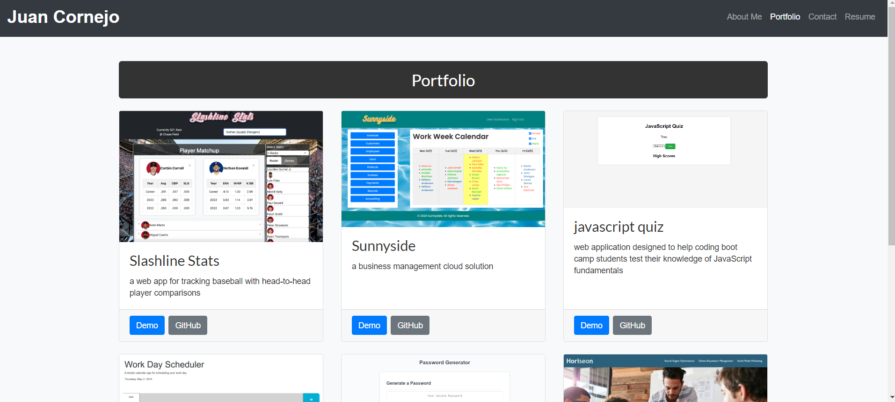
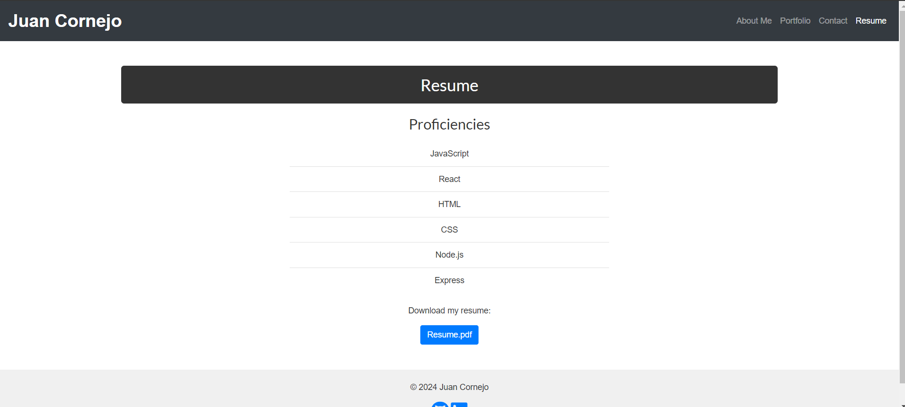

# My React Portfolio

Welcome to my React portfolio! This project showcases my skills and projects as a web developer.

## Table of Contents

- [About](#about)
- [Screenshots](#screenshots)
- [Deployed Website](#deployed-website)
- [Technologies Used](#technologies-used)
- [Usage](#usage)
- [Contributing](#contributing)
- [License](#license)

## About

This portfolio is built using React and deployed on Netlify. It includes sections for About Me, Portfolio, Contact, and Resume. The navigation bar allows easy access to different sections of the portfolio.

## Screenshots

- About Me Section:
  

- Portfolio Section:
  

- Contact Section:
  

- Resume Section:
  

## Deployed Website

You can view the deployed portfolio [here]([https://main--juanacornejo-portfolio.netlify.app/]).

## Technologies Used

- React
- React Router
- Netlify
- Javascript
- CSS
- Node
- Vite

## Usage

To run this project locally, follow these steps:

1. Clone the repository:

   git clone https://github.com/juanycorn/React_Portfolio

2. Navigate to the project directory:

    cd React_Portfolio

3. Install dependencies:
    
    npm install

4. Run the project:

    npm start
